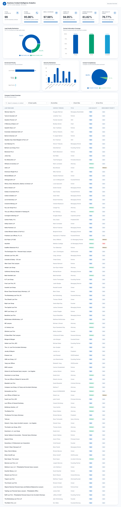

# Business Contact Intelligence Analytics

## Project Overview

Business Contact Intelligence Analytics is a Python-based data analytics project designed to evaluate and improve the quality of business contact and lead generation data.

The project analyzes a dataset of 99 business contacts from law firms and transforms raw contact information into actionable business insights through data cleaning, quality auditing, lead scoring, contact completeness analysis, seniority analysis, duplicate detection, enrichment prioritization, and data visualization.

The project demonstrates a complete data analytics workflow from raw data ingestion to business insights and dashboard reporting.

---

## Project Objectives

The main objectives of this project are to:

* Clean and standardize raw business contact data
* Identify missing and incomplete contact information
* Detect duplicate records and potential duplicate companies
* Validate phone numbers and email addresses
* Analyze contact completeness
* Identify senior decision makers
* Score and classify lead quality
* Measure business contact coverage
* Prioritize contacts requiring data enrichment
* Generate visual analytics charts
* Produce actionable business insights

---

## Dataset

The dataset contains **99 business contacts** from **99 unique law firms**.

### Main Data Fields

* Law Firm Name
* Website
* Address
* Phone Number
* First Name
* Last Name
* Title
* Email

---

## Key Analytics Results

| Metric                         |   Result |
| ------------------------------ | -------: |
| Total Contacts                 |       99 |
| Total Unique Companies         |       99 |
| Phone Coverage                 |   95.96% |
| Email Coverage                 |   97.98% |
| Complete Contact Coverage      |   94.95% |
| Senior Decision Maker Coverage |   81.82% |
| High Quality Lead Coverage     |   76.77% |
| Average Lead Quality Score     | 8.33 / 9 |

---

## Lead Quality Analysis

The project uses a scoring system to evaluate the quality of each business contact.

Points are assigned based on:

* Senior decision maker status
* Email availability
* Phone availability
* Website availability
* Contact name availability

### Lead Quality Distribution

* High Quality Leads: 76
* Medium Quality Leads: 23
* Low Quality Leads: 0

The average lead quality score is **8.33 out of 9**, indicating strong overall lead quality.

---

## Contact Completeness

Contact completeness is evaluated based on the availability of phone and email information.

The analysis found:

* 94 contacts with complete phone and email information
* 5 contacts requiring additional data enrichment

### Data Enrichment Priority

* Low Priority: 94
* Medium Priority: 4
* High Priority: 1

This allows incomplete records to be prioritized for future research and enrichment.

---

## Senior Decision Maker Analysis

The project identifies senior decision makers based on contact titles.

Examples include:

* Owner
* Partner
* Managing Partner
* Founder
* CEO
* President
* Chair

The analysis identified **81.82% of contacts as Senior Decision Makers**, making the dataset suitable for targeted business outreach.

---

## Data Quality Findings

### Missing Information

The analysis identified:

* 2 missing email addresses
* 4 missing phone numbers

These records were included in the data enrichment analysis.

### Potential Duplicate Company

One potential duplicate company was identified:

* Downtown La Law Group
* Downtown L.A. Law Group

The two records contain matching contact information and should be reviewed for possible consolidation.

---

## Visualizations

The project includes several charts to support data interpretation and business reporting.

### Main Visualizations

* KPI Overview
* Lead Quality Distribution
* Data Enrichment Priority Distribution
* Contact Information Coverage
* Senior vs Non-Senior Contacts

Charts are stored in:

```text
dashboard/charts/
```

Additional analysis visualizations are stored in:

```text
src/visualization/charts/
```

---

## Project Structure

```text
Business_Contact_Intelligence_Analytics
│
├── analytics.py
├── README.md
├── requirements.txt
├── .gitignore
│
├── data
│   ├── raw
│   ├── cleaned
│   └── processed
│
├── src
│   ├── data_loading
│   │   └── load_data.py
│   │
│   ├── data_cleaning
│   │   └── clean_data.py
│   │
│   ├── data_analysis
│   │   └── analyze_data.py
│   │
│   └── visualization
│       ├── visualize_data.py
│       └── charts
│
├── dashboard
│   ├── dashboard.py
│   └── charts
│
├── reports
│   └── business_insights.md
│
├── screenshots
├── docs
├── notebooks
├── sql
└── tests
```

---

## Technologies Used

* Python
* Pandas
* SQLite
* SQL
* Matplotlib
* Excel
* CSV
* Data Cleaning
* Data Analysis
* Data Visualization
* Dashboard Development

---

## Python Libraries

The project uses the following main Python libraries:

```text
pandas
matplotlib
openpyxl
```

Install the required dependencies using:

```bash
pip install -r requirements.txt
```

---

## How to Run the Project

### 1. Clone the Repository

```bash
git clone YOUR_GITHUB_REPOSITORY_URL
```

### 2. Open the Project

```bash
cd Business_Contact_Intelligence_Analytics
```

### 3. Create a Virtual Environment

```bash
python -m venv .venv
```

### 4. Activate the Virtual Environment

Windows:

```bash
.venv\Scripts\activate
```

### 5. Install Dependencies

```bash
pip install -r requirements.txt
```

### 6. Run Analytics

```bash
python analytics.py
```

### 7. Run Dashboard

```bash
python dashboard/dashboard.py
```

---

## Business Insights

The analysis demonstrates that the dataset has strong overall contact quality.

Approximately **96% of contacts have phone numbers**, while almost **98% have email addresses**. Nearly **95% of contacts have both phone and email information available**.

The dataset also contains a strong proportion of senior decision makers, with **81.82% of contacts classified as senior decision makers**.

Furthermore, **76.77% of contacts are classified as High Quality Leads**, making them suitable candidates for prioritized business outreach.

Only five contacts require additional data enrichment, indicating that the majority of the dataset is already ready for practical use.

---

## Future Improvements

Potential future improvements include:

* Automated email verification
* Phone number validation using external APIs
* Company website verification
* LinkedIn profile enrichment
* Automated duplicate company matching
* CRM integration
* Interactive business intelligence dashboard
* Automated data refresh pipelines
* Lead scoring optimization using machine learning

---

## Author

**Aman Fatima**

BS Software Engineering Student

Skills demonstrated in this project:

* Python
* Pandas
* Data Cleaning
* Data Analysis
* Data Visualization
* Excel
* Lead Generation
* Web Research
* Business Intelligence

---

---

# 📊 Executive Dashboard

The project includes a professional executive dashboard designed to transform business contact data into meaningful visual insights for business decision-making.

## Dashboard Features

- Executive KPI Overview
- Lead Quality Distribution
- Contact Information Coverage
- Enrichment Priority Analysis
- Seniority Distribution
- Contact Completeness
- Company Contact Overview

## Dashboard Preview



## Full Dashboard

The complete dashboard is available here:

`dashboard/Business_Contact_Intelligence_Dashboard.pdf`

## Project Status

**Completed**

This project demonstrates an end-to-end business contact data analytics workflow, from raw dataset processing to analytical insights, visualizations, and dashboard reporting.
